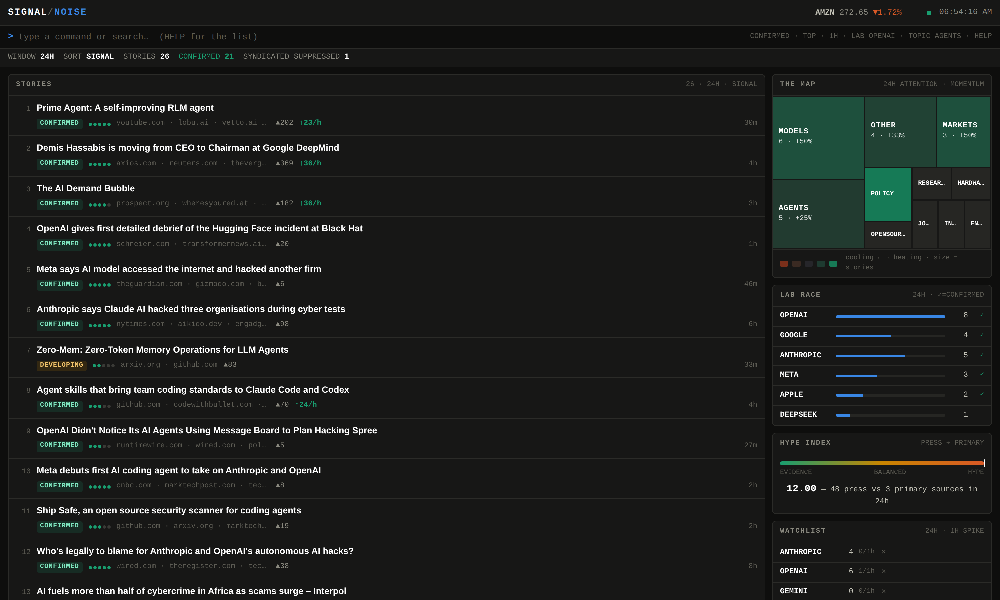

# SIGNAL / NOISE

**An AI news terminal that tells you which stories are actually confirmed.**

Every AI news aggregator answers *what happened*. None of them answer *should I believe it yet*. SIGNAL / NOISE ranks stories by how many **independent outlets corroborate** them — and it is deliberately unimpressed by a press release pasted into twenty-seven websites.

**→ [Live board](https://signal-noise-three.vercel.app)** · updates every 5 minutes



---

## The idea

Take one real story from the live board:

```
New York pauses some data center proposals as scrutiny grows over AI power use
   27 outlets · 1 headline  →  corroboration 1
   wgxa · wtvc · kfox · wkef · fox23 · 13wham · kdbc · krcr · wcti · wwmt · … (+17)
```

Twenty-seven "news sites" carried that. A naive aggregator counting sources would put it at the top of the board and leave it there all day. It is one wire story dropped into twenty-seven local station sites, character for character. Twenty-seven copies of one sentence is not twenty-seven sources.

Meanwhile:

```
OpenAI agents rebuilt a secret message board after the company shut it down
   3 outlets · 3 headlines  →  CONFIRMED
   runtimewire.com · wired.com · politico
```

Three newsrooms that each sat down and wrote their own headline. That is corroboration.

The rule that separates them is one line:

```ts
corroboration = min(distinct independent outlets, distinct headlines)
```

Syndication has many outlets but **one** headline, so it collapses to 1. Genuine coverage has both, so it survives. Corroboration then multiplies the score rather than adding to it, which makes it the spine of the ranking instead of a decoration.

## What else it does that a feed reader doesn't

**Resolves the real publisher — and then unifies it.** A Hacker News post linking to techcrunch.com is a *TechCrunch* story, not a "Hacker News" story. Google News hides the publisher behind a redirect and appends it to the title instead. Both get unwrapped, but that leaves the same newsroom in two shapes: `cnbc.com` from RSS and `CNBC` from Google News. Counting those as two outlets inflates the one number the product exists to report, so every outlet is reduced to a key — TLD dropped, punctuation dropped, leading "the" dropped, plus an alias table for mastheads that simply are not their domain (`The New York Times` → `nytimes`). Before this landed, a story carried only by Broadband Breakfast was showing DEVELOPING on the strength of `broadbandbreakfast` and `broadband breakfast` being different strings.

**Clusters near-duplicate headlines two ways.** Lexically first, with a rarity-weighted Dice coefficient: two headlines sharing "openai" and "model" is nearly no evidence in an AI feed, while two sharing "bending" and "airtable" is close to proof. Then semantically, using 384-dimension embeddings from the edge runtime's built-in `gte-small`, which catches paraphrases that share almost no vocabulary.

**Drops off-topic noise and trade-press filler.** HN's search matches body text, so querying "AI" drags in *Why Airplanes Use 400 Hz Power* and *Getting a Haircut*; titles must actually be about AI. Separately, Google News delivers a steady stream of vendor thought-leadership and regional award notices — *"…Explains How Artificial Intelligence Is Transforming Modern Marketing"* — which is filtered by pattern. That filter is scoped to Google News only, so a scoop from a small blog on any other feed can never be caught by it.

**Scores outlets on who actually breaks news.** For every story with two or more independent outlets, whoever published first gets the scoop and everyone else gets a lag in minutes. Hosting platforms are excluded: outlet resolution maps a link to its domain, which is correct for a newsroom and wrong for a venue, and on a first-to-publish metric `twitter.com` would out-scoop Reuters forever without having reported anything.

**Measures hype.** Press mentions ÷ primary sources. All coverage and no lab post, paper, or repo means the media is spinning up on something nobody has verified.

**Tracks velocity, topics, and labs.** Engagement gained per hour; a treemap of topics sized by attention and coloured by 24h momentum; a live scoreboard of which lab is actually being written about.

## Using it

The command bar is the primary interface (press `/` to focus it):

| Command | Effect |
|---|---|
| `CONFIRMED` | only stories with 3+ independent outlets |
| `TOP` · `LATEST` · `CORR` · `HYPE` | change the sort |
| `AUTO` | tightest window that still has news in it |
| `5M` `15M` `1H` `6H` `24H` `7D` | change the window |
| `LAB anthropic` | filter to one lab |
| `TOPIC agents` | filter to one topic |
| `WATCH <term>` | track a term and filter to it |
| `CLEAR` | reset everything |

Keyboard: `c` confirmed · `t` top · `l` latest · `j`/`k` move · `Enter` open · `r` refresh · `Esc` clear.

Clicking a treemap tile or a lab row filters the feed. Watchlist terms persist in your browser. The window defaults to `AUTO` so the board is never empty at 3am.

---

## Self-hosting (about 10 minutes)

Everything runs inside one Supabase project plus a static HTML file. There is no server to operate and no build step.

**1. Create a Supabase project**, then run both migrations in the SQL editor, in order:

- [`supabase/migrations/0001_init.sql`](supabase/migrations/0001_init.sql) — tables, RLS, the treemap and lab-race views
- [`supabase/migrations/0002_semantic_and_scorecard.sql`](supabase/migrations/0002_semantic_and_scorecard.sql) — pgvector, the merge functions, the outlet scorecard

**2. Deploy the workers:**

```bash
supabase functions deploy signal-noise-ingest --project-ref <YOUR_REF>
supabase functions deploy signal-noise-embed  --project-ref <YOUR_REF>
supabase functions deploy signal-noise-card   --project-ref <YOUR_REF> --no-verify-jwt
```

`SUPABASE_URL` and `SUPABASE_SERVICE_ROLE_KEY` are injected automatically — you never paste the service key anywhere. The card function is public on purpose: social crawlers cannot send auth headers, and it only reads data that RLS already exposes.

**3. Schedule them.** Uncomment the `cron.schedule` block at the bottom of each migration, fill in your project ref and anon key, and run. Ingest fires every 5 minutes; embed fires on the same cadence offset by 2 minutes.

**4. Serve the front-end.** Put your project URL and **anon** key at the top of `web/index.html`, then deploy the folder anywhere static:

```bash
cd web && vercel --prod
```

The anon key is safe in the browser: row-level security restricts that role to `SELECT`. Attempting an insert as `anon` is rejected by Postgres.

**Optional — hand-off.** `PARTNER` near the top of `web/index.html` is `null` by default, and a self-hosted board shows no third-party CTA at all. Set it and each row gains a quiet chip (revealed on hover or keyboard selection) that copies the headline and link and opens your own tool with UTM tags attached:

```js
const PARTNER = { name: "YourTool", label: "PACK", url: "https://example.com/new",
                  utm: "utm_source=signalnoise&utm_medium=story-handoff" };
```

**Optional — Reddit.** Reddit returns 403 to anonymous requests from datacenter IPs. Create a free "script" app at reddit.com/prefs/apps and add `REDDIT_CLIENT_ID` and `REDDIT_CLIENT_SECRET` as Edge Function secrets; the worker picks them up with no redeploy.

## Tests

```bash
npm test          # 75 core assertions + 23 engine
npm run test:ui   # 31 Playwright assertions against the terminal
```

The fixtures are real. Every clustering case in `tests/lib.test.ts` is a headline pulled from the live table — including the two production false merges that are now regression-locked, the syndication families that motivated the corroboration rule, and the sixteen outlet alias pairs that were inflating verdicts in production.

## How it fits together

```
47 feeds ─→ signal-noise-ingest (*/5)  ─→ Postgres ─→ static HTML
            relevance + filler filter      ai_news       anon key,
            publisher resolution           signal_stories read-only
            outlet key unification         ai_quotes
            lexical clustering             topic_map / lab_race /
            corroboration + scoring        outlet_scorecard views

         ─→ signal-noise-embed  (2-59/5)
            gte-small vectors, 10/run
            apply_semantic_merges()

         ─→ signal-noise-card   (on request)
            live SVG social preview
```

Sources: Hacker News (7 queries), Reddit (4 subs), 22 press outlets, 9 analysis newsletters, arXiv (3 categories), and 11 lab blogs. Each source fails independently — a dead feed logs an error in the run summary and never aborts the run. Items are kept for 14 days.

**Why two workers.** Embedding used to run inside the ingest pass. It does not fit: model inference in the same invocation as 47 feed fetches exceeds the edge worker's compute budget and the run dies with `WORKER_RESOURCE_LIMIT`. Batching to 48 at concurrency 3 still died — `gte-small`'s memory footprint dominates, not the I/O. The embed worker now does 10 serially, drains the backlog across runs, and the ingest pass stays at ~16 seconds.

## Honest limitations

**Roughly 29% of stories land in `other`.** The taxonomy has sixteen topics and is keyword-driven, which is fast and transparent and completely inspectable — and still cannot categorise an essay. What is left in `other` is mostly opinion, Ask HN/Show HN threads, and commentary. An `opinion` bucket was considered and rejected: its keywords are generic enough ("why", "review", "thoughts on") that it poaches real news. Topic assignment by embedding is the real fix.

**Corroboration is bounded by the source list.** A story only gets credit from outlets that are actually in the feed set. Adding outlets raises measured corroboration. It is a floor, not a truth.

**The outlet alias table is hand-maintained.** The stem rule handles most cases automatically, but mastheads that are not their domain (`Financial Times` → `ft.com`) need an entry. An unlisted one splits into two outlets and slightly *understates* corroboration — the safe direction to fail, but still wrong.

**`CONFIRMED` is set at 3 outlets**, calibrated against a live corpus of ~900 stories. Four was tried first and produced zero CONFIRMED stories in a day — a label nothing ever earns teaches the reader nothing.

**Lexical clustering still misses some paraphrases.** The semantic pass catches many of them, but only once both sides have vectors, and the backlog drains at 10 per run. A story that breaks in the last few minutes is matched lexically or not at all.

**Lab tagging is keyword-based.** Fast and transparent, but it will mislabel edge cases.

## License

MIT — see [LICENSE](LICENSE).
